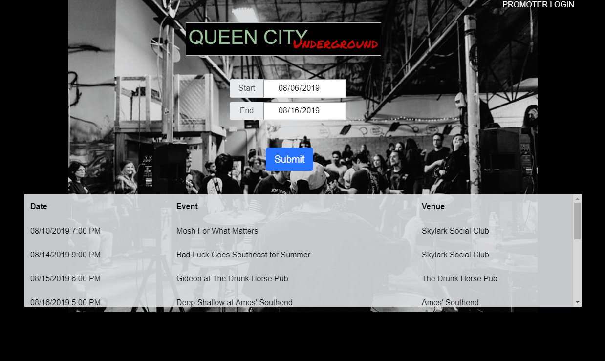

# QUEEN CITY UNDERGROUND 
## Project 2
This application was developed to help users discover the variety of music available in Charlotte, NC. With this application users can find the events, venues, and ticket info for specific dates.

Promotors can register to add their own upcoming events!

## TECHNOLOGY
<ul>
    <li>Bootstrap - https://getbootstrap.com/docs/4.3/getting-started/introduction/</li> 
    <li>Handlebars - http://handlebarsjs.com/</li>
    <li>MySQL - https://www.mysql.com/</li>
    <li>Node.js - https://nodejs.org/en/</li>
    <li>Passport - http://www.passportjs.org/</li> 
    <li>Sequelize - https://sequelize.org</li>     
</ul>

## Developers
<ul>
    <li>Bella Gianna - <a href="https://github.com/bellabluebells" target="_blank">Github</a></li>
    <li>Sean Nguyen - <a href="https://github.com/Juwami" target="_blank">Github</a></li>
    <li>Louis Rollins - <a href="https://github.com/LouisRollins" target="_blank">Github</a></li>
    <li>Chris Ross - <a href="https://github.com/vtchris" target="_blank">Github</a></li>
</ul>